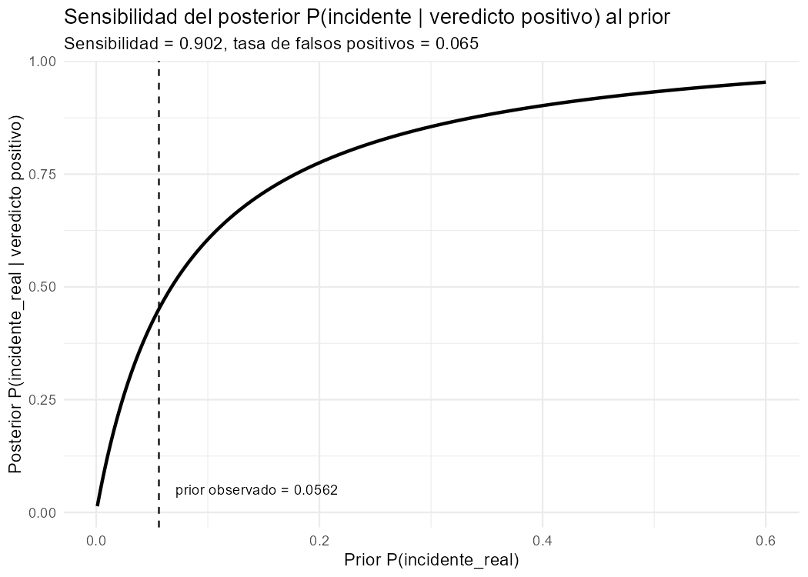
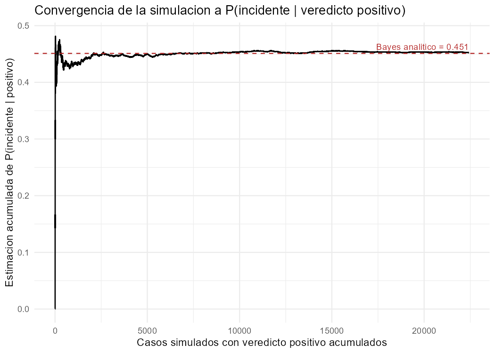
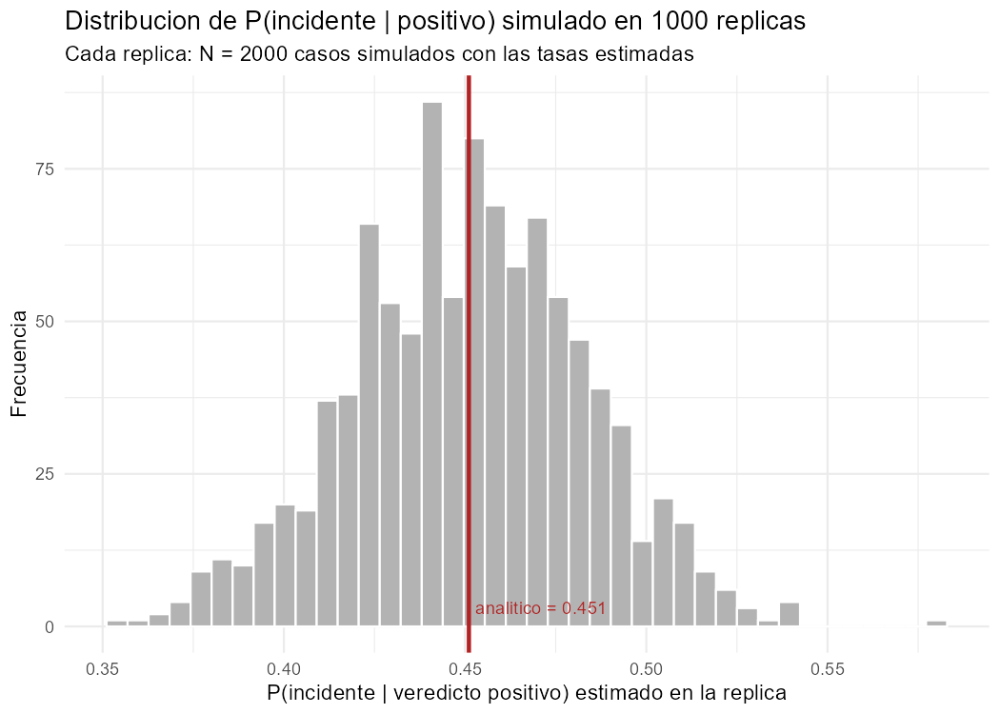

```{r setup, include=FALSE}
knitr::opts_chunk$set(echo = TRUE, warning = FALSE, message = FALSE)
knitr::opts_knit$set(root.dir = "..")
```

```{r cargar-config}
source("scripts/00_configuracion.R")
datos <- read_rds(RUTA_DATOS_PROCESADOS_RDS)
```

## 1. Introducción

Este informe consolida las cuatro fases previas de un proyecto integrador de
Probabilidades aplicado a un log de eventos de seguridad
(`eventos_seguridad.csv`, `r nrow(datos)` filas, 8 columnas originales). El
hilo conductor del proyecto es una sola pregunta operativa:

> Cuando el detector automático marca un evento como **positivo** (posible
> malware), ¿qué tan probable es que realmente sea un incidente?

Para responderla se recorre el camino clásico de un curso de probabilidad:
combinatoria para dimensionar espacios de resultados (Fase 2), probabilidad
condicional y total a partir de la muestra (Fase 2), el Teorema de Bayes
para invertir el condicionamiento y actualizar creencias (Fase 3), y una
simulación Monte Carlo que valida que el resultado analítico no es un
artefacto de las fórmulas sino algo que efectivamente ocurre al generar
datos con esas mismas tasas (Fase 4).

Toda la aleatoriedad del proyecto usa una **semilla fija** definida una sola
vez en [`scripts/00_configuracion.R`](../scripts/00_configuracion.R):

```{r semilla, echo=FALSE}
cat("SEMILLA_PROYECTO <-", SEMILLA_PROYECTO)
```

El detalle cronológico de cada prompt usado para construir este proyecto,
las preguntas que surgieron y las decisiones tomadas están en
[`bitacora.md`](../bitacora.md).

## 2. Fase 1 — Limpieza de datos

El CSV original mezclaba formatos de fecha, mayúsculas/minúsculas,
sinónimos, errores de tipeo, texto con comas decimales y varios valores
centinela de error. La limpieza completa está en
[`scripts/01_limpieza_datos.R`](../scripts/01_limpieza_datos.R); el resumen
de problemas y su tratamiento:

```{r tabla-limpieza, echo=FALSE}
tabla_limpieza <- tribble(
  ~Columna, ~Problema, ~Tratamiento,
  "fecha", "3 formatos mezclados y vacíos", "Parseo de los 3 formatos con lubridate + coalesce()",
  "modulo", "Mayúsculas/minúsculas, espacios, sinónimos, typos", "Normalizado a 4 categorías: api, auth, db, ui",
  "alerta / incidente_real", "0/1, sí/no, SI/NO, true/false, yes, N/A, ?", "Normalizado a lógico TRUE/FALSE",
  "veredicto", "clean/limpio/malware/MALWARE/+/-/positivo/negativo", "Binarizado a positivo/negativo (supuesto documentado)",
  "tam_commit", "Negativos y centinela 999999", "Marcados como atípicos → NA",
  "t_respuesta_h", "Texto con coma decimal; negativos y centinela 99999", "Convertido a numérico; atípicos → NA",
  "id_evento", "No es único (139 filas repetidas)", "No se eliminan filas; se marca id_duplicado"
)
knitr::kable(tabla_limpieza)
```

Los dos valores centinela (`tam_commit == 999999` y `t_respuesta_h == 99999`)
no estaban documentados en el enunciado original; el segundo se descubrió en
la Fase 2 al calcular un tiempo medio de respuesta absurdo (2143 horas) para
el módulo `auth`, lo que obligó a corregir retroactivamente la Fase 1 (queda
registrado en la bitácora).

Vista de los datos ya limpios:

```{r muestra-datos}
datos |> select(-id_duplicado, -tam_commit_atipico, -t_respuesta_h_atipico) |>
  head(8) |>
  knitr::kable()
```

## 3. Fase 2 — Combinatoria y probabilidad

### 3.1 Reto 1a — Espacio de claves

Espacio muestral: contraseñas de longitud `L = 8` con alfabeto alfanumérico
`N = 62`. Importa el orden y hay reemplazo → **variación con repetición**
`VR(n,r) = n^r`.

```{r reto1-claves}
reto1 <- read_csv("resultados/reto1_combinatoria.csv", show_col_types = FALSE)
obtener1 <- function(m) reto1$valor[reto1$metrica == m]
```

- Tamaño del espacio de claves: VR(62, 8) ≈ `r format(as.numeric(obtener1("espacio_claves_VR")), scientific = TRUE, digits = 4)`
- P(acertar en un intento) ≈ `r format(as.numeric(obtener1("p_acertar_un_intento")), scientific = TRUE, digits = 4)`
- Usando el tiempo medio real de respuesta de `auth`
  (`r round(as.numeric(obtener1("tiempo_medio_auth_h")), 2)` h) como tiempo
  ilustrativo por intento, agotar el espacio tomaría del orden de
  `r format(as.numeric(obtener1("anios_estimados_fuerza_bruta")), scientific = TRUE, digits = 4)`
  años — un ejercicio de escala, no una medición real de ataque.

### 3.2 Reto 1b — Espacio de logs

Espacio muestral: subconjuntos de tamaño m = `r obtener1("tamano_muestra_m")`
de los n = `r obtener1("n_eventos_modulo_top")` eventos del módulo con más
actividad (`r obtener1("modulo_top")`). No importa el orden y no hay
reemplazo → **combinación sin repetición**.

- C(n, m) = `r format(as.numeric(obtener1("combinaciones_C")), big.mark = ",", scientific = FALSE)`
- V(n, m) = `r format(as.numeric(obtener1("variaciones_V")), big.mark = ",", scientific = FALSE)` (si el orden importara)
- P(una muestra particular) ≈ `r format(as.numeric(obtener1("p_muestra_particular")), scientific = TRUE, digits = 4)`

### 3.3 Reto 2 — Probabilidad condicional y probabilidad total

```{r reto2-alerta}
reto2_alerta <- read_csv("resultados/reto2_condicional_alerta.csv", show_col_types = FALSE)
knitr::kable(reto2_alerta, digits = 4)
```

Una alerta activa (`alerta = TRUE`) eleva `P(incidente_real)` de
`r round(reto2_alerta$p_incidente_dado_alerta[reto2_alerta$alerta == FALSE], 4)`
a `r round(reto2_alerta$p_incidente_dado_alerta[reto2_alerta$alerta == TRUE], 4)`.

Probabilidad total de incidente, partiendo el espacio muestral por `modulo`:

```{r reto2-modulo}
reto2_modulo <- read_csv("resultados/reto2_probabilidad_total_modulo.csv", show_col_types = FALSE)
knitr::kable(reto2_modulo, digits = 4)
```

P(incidente) = Σ P(incidente | modulo) · P(modulo) = `r round(sum(reto2_modulo$aporte), 4)`,
idéntico al cálculo directo sobre los mismos datos.

## 4. Fase 3 — Teorema de Bayes y sensibilidad del prior

```{r reto3-confusion}
reto3_confusion <- read_csv("resultados/reto3_tabla_confusion.csv", show_col_types = FALSE)
knitr::kable(reto3_confusion)

reto3 <- read_csv("resultados/reto3_resumen_bayes.csv", show_col_types = FALSE)
obtener3 <- function(m) reto3$valor[reto3$metrica == m]
```

A partir de la tabla de confusión se estiman:

- Prior P(incidente) = `r round(as.numeric(obtener3("prior_incidente")), 4)`
- Sensibilidad P(positivo | incidente) = `r round(as.numeric(obtener3("sensibilidad")), 4)`
- Falsos positivos P(positivo | NO incidente) = `r round(as.numeric(obtener3("tasa_falsos_positivos")), 4)`

Aplicando Bayes:

$$P(\text{incidente} \mid \text{positivo}) = \frac{P(\text{positivo}\mid\text{incidente})\,P(\text{incidente})}{P(\text{positivo})} = `r round(as.numeric(obtener3("p_incidente_dado_positivo_bayes")), 4)`$$

Este valor coincide, hasta error de punto flotante, con el cálculo directo
sobre los datos (`r round(as.numeric(obtener3("p_incidente_dado_positivo_directo")), 4)`).
Un veredicto positivo sube la creencia de incidente de
`r round(as.numeric(obtener3("prior_incidente")), 4)` a
`r round(as.numeric(obtener3("p_incidente_dado_positivo_bayes")), 4)`
(×`r round(as.numeric(obtener3("p_incidente_dado_positivo_bayes")) / as.numeric(obtener3("prior_incidente")), 1)`),
pero **sigue sin superar el 50 %**: el incidente real es raro y el detector
todavía genera falsos positivos.

### 4.1 P(A\|B) vs. P(B\|A) vs. correlación

|  | Valor |
|---|---|
| P(incidente \| alerta) | `r round(as.numeric(obtener3("p_incidente_dado_alerta")), 4)` |
| P(alerta \| incidente) | `r round(as.numeric(obtener3("p_alerta_dado_incidente")), 4)` |
| Correlación(alerta, incidente) | `r round(as.numeric(obtener3("correlacion_alerta_incidente")), 4)` |

Los tres números responden preguntas distintas: el primero mide qué tan
confiable es una alerta ya emitida; el segundo, qué tan seguido el sistema
reacciona ante un incidente real; la correlación es una sola medida
simétrica que no distingue la dirección del condicionamiento.

### 4.2 Sensibilidad del prior

```{r reto3-sensibilidad-tabla}
reto3_sens <- read_csv("resultados/reto3_sensibilidad_prior.csv", show_col_types = FALSE)
knitr::kable(reto3_sens, digits = 4)
```



El posterior es muy sensible al prior cuando este es bajo (el rango típico
de incidentes reales) y se aplana a medida que el prior crece — la
conclusión de Bayes depende fuertemente de qué tan bien estimado esté el
prior en un escenario de eventos raros.

## 5. Fase 4 — Validación por simulación Monte Carlo

```{r reto4-comparacion}
reto4_comp <- read_csv("resultados/reto4_comparacion_analitico_simulado.csv", show_col_types = FALSE)
knitr::kable(reto4_comp, digits = 5)
```

```{r reto4-replicas}
reto4_rep <- read_csv("resultados/reto4_resumen_replicas.csv", show_col_types = FALSE)
obtener4 <- function(m) reto4_rep$valor[reto4_rep$metrica == m]
```

Simulando `r format(as.numeric(obtener4("n_simulacion_unica")), big.mark=",", scientific=FALSE)`
casos con el mecanismo incidente → veredicto (usando prior, sensibilidad y
falsos positivos estimados en la Fase 3), todas las cantidades simuladas
quedan a menos de 0.002 de su valor analítico.



Repitiendo la simulación `r as.integer(obtener4("r_replicas"))` veces con
N = `r as.integer(obtener4("n_replica"))` casos cada una, el valor
analítico (`r round(as.numeric(obtener4("valor_analitico")), 4)`) cae dentro
del intervalo de 95 % de las réplicas
(`r round(as.numeric(obtener4("ic95_inferior")), 4)` –
`r round(as.numeric(obtener4("ic95_superior")), 4)`), con una diferencia muy
por debajo de la esperada solo por variabilidad de muestreo:



**Conclusión:** el modelo es
**`r if (as.logical(as.numeric(obtener4("coherente")))) "coherente" else "inconsistente"`**
— la simulación reproduce los resultados analíticos de Bayes dentro del
margen esperado por puro muestreo.

## 6. Conclusiones generales

- El detector es sensible (`~90 %`) pero no lo suficientemente preciso como
  para que un solo veredicto positivo, por sí solo, sea prueba de un
  incidente real (posterior `~45 %`): en la práctica, un veredicto positivo
  debería **elevar la prioridad de revisión**, no disparar una conclusión
  automática de incidente.
- `alerta` es una señal más fuerte que aislada podría parecer poco
  informativa si solo se mirara la correlación: `P(incidente|alerta)`
  cuadriplica el prior, pero la correlación simple (0.56) no comunica esa
  asimetría.
- La probabilidad de incidente varía por módulo (mayor en `db`, menor en
  `ui`), lo que sugiere que el prior "correcto" para Bayes debería, en un
  análisis más fino, condicionarse también por módulo y no solo ser un
  promedio global.
- La simulación Monte Carlo confirma que los resultados analíticos no
  dependen de un error de cálculo: el mismo mecanismo generador, simulado
  muchas veces, reproduce las mismas probabilidades.

### Limitaciones y supuestos a defender

- `veredicto` se binarizó a positivo/negativo por decisión conjunta con el
  usuario; una versión con más categorías podría revelar matices (ej.
  distinguir `malware` confirmado de una simple `alerta` sin confirmar).
- `id_evento` duplicado (139 filas) no se investigó a fondo: se asumió que
  cada fila es un evento de log independiente, no necesariamente que
  `id_evento` sea una clave primaria.
- Los parámetros del Reto 1a (alfabeto de 62 caracteres, longitud 8) son
  supuestos de política de contraseñas, no datos observados.

## 7. Guion de defensa (preguntas anticipadas)

**¿Por qué convertir `tam_commit` y `t_respuesta_h` centinela a NA en vez de
a 0 o al promedio?**
Porque imputar un valor cambiaría artificialmente las distribuciones y
podría sesgar los promedios usados más adelante (ej. el tiempo medio de
`auth` usado en el Reto 1a). `NA` deja explícito que el dato no es
confiable, y todas las funciones de resumen (`mean()`, filtros) lo excluyen
de forma consistente.

**¿Por qué el posterior de Bayes (`45 %`) es tan distinto de la sensibilidad
del detector (`90 %`)?**
Porque la sensibilidad responde "si hay incidente, ¿qué tan seguido el
detector avisa?", mientras que el posterior responde la pregunta inversa:
"si el detector avisó, ¿qué tan seguido había incidente?". Como los
incidentes son raros (prior `5.6 %`), incluso una tasa de falsos positivos
baja (`6.5 %`) genera muchas más alertas falsas que verdaderas en términos
absolutos — el clásico efecto de base rate en Bayes.

**¿Cómo se sabe que la simulación Monte Carlo no está "haciendo trampa" al
reproducir el valor analítico?**
La simulación no usa el valor analítico como entrada: solo usa las tres
tasas independientes (prior, sensibilidad, falsos positivos) y genera casos
al azar con `rbinom()`. Que el resultado converja al valor de Bayes es
evidencia de que la fórmula de Bayes está bien aplicada, no una
tautología — si la fórmula estuviera mal, simulación y análisis
divergirían.

**¿Por qué la semilla es `2026` y no otra?**
Es un valor arbitrario pero fijo, elegido por ser el año del dataset;
cualquier semilla fija sirve para reproducibilidad, lo importante es que
esté definida una sola vez (`scripts/00_configuracion.R`) y se use en todo
el proyecto.

## 8. Reproducibilidad

Para reproducir este informe desde cero:

```bash
Rscript scripts/01_limpieza_datos.R
Rscript scripts/02_combinatoria_probabilidad.R
Rscript scripts/03_bayes.R
Rscript scripts/04_montecarlo.R
```

y luego renderizar este archivo (`informes/informe_final.Rmd`) con
`rmarkdown::render()` o el botón *Knit* de RStudio.
